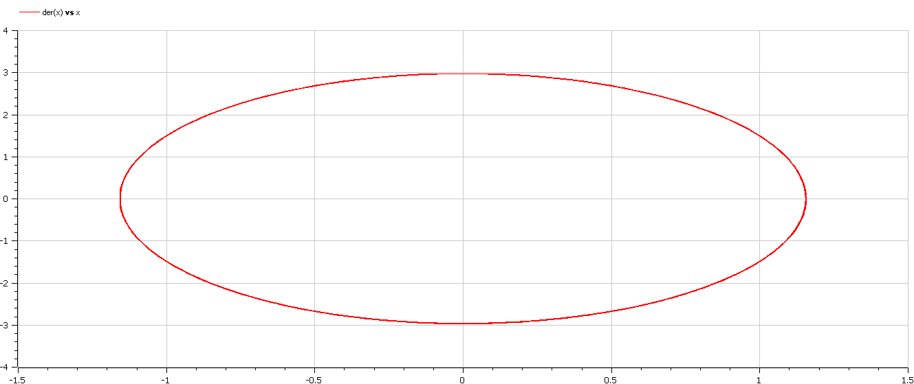
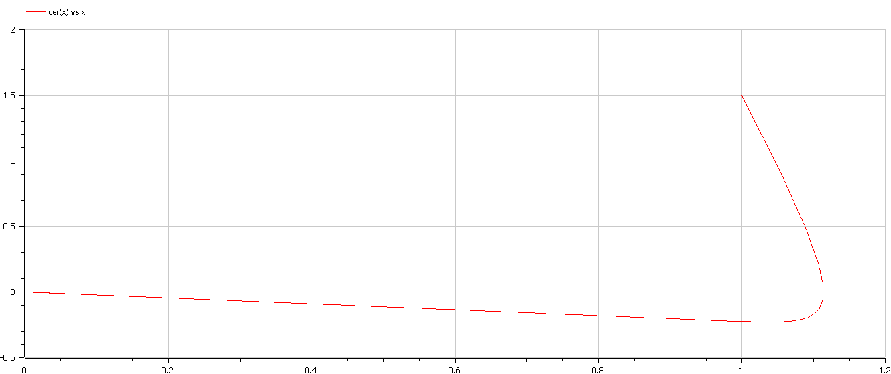
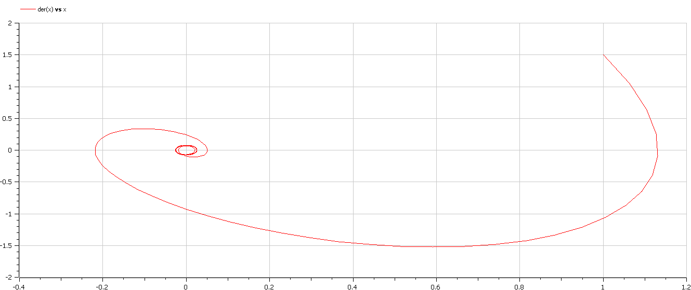

# Лабораторная работа №4
## Василий Худицкий 
## РУДН, 2022 Москва, Россия

---

# Прагматика лабораторной работы

- Знакомство с основной моделью в теории колебаний – линейным гармоническим осциллятором.

- Визуализация результатов моделирования путем построения фазового портрета гармонического осциллятора.

---

# Цель лабораторной работы

- Научиться строить модели гармонических колебаний.
- Научиться решать уравнения гармонического осциллятора.
- Научиться переходить от дифференциального уравнения второго порядка к системе из двух дифференциальных уравнений первого порядка.
- Научиться строить фазовый портрет гармонических колебаний.

---

### Задание лабораторной работы

Постройте фазовый портрет гармонического осциллятора и решение уравнения гармонического осциллятора для следующих случаев
1. Колебания гармонического осциллятора без затуханий и без действий внешней силы:
$\ddot{x}+6.6x=0$
2. Колебания гармонического осциллятора c затуханием и без действий внешней силы:
$\ddot{x}+9\dot{x}+2x=0$
3. Колебания гармонического осциллятора c затуханием и под действием внешней силы:
$\ddot{x}+2.4\dot{x}+6x=0.2cos(3t)$

На интервале $t\in[0;52]$ (шаг $0.05$) с начальными условиями $x_0=1$, $y_0=-1.5$.

---

# Результаты выполнения лабораторной работы

---

### Представление уравнения второго порядка в виде системы двух уравнений первого порядка

1. Уравнение $\ddot{x}+6.6x=0$ приводится к системе вида:
$\begin{cases} \dot{x}=y \\ \dot{y} = -6.6x \end{cases}$
2. Уравнение $\ddot{x}+9\dot{x}+2x=0$ приводится к системе вида:
$\begin{cases} \dot{x}=y \\ \dot{y}=-9y-2x \end{cases}$
3. Уравнение $\ddot{x}+2.4\dot{x}+6x=0.2cos(3t)$ приводится к системе вида:
$\begin{cases} \dot{x}=y \\ \dot{y}=-2.4y-6x+0.2cos(3t)\end{cases}$

---

# Построение графиков фазового портрета

---

#### 
##### Рис.1 Модель колебаний  гармонического осциллятора без затуханий и без действий внешней силы

---

#### 
##### Рис.2 Модель колебаний  гармонического осциллятора c затуханием и без действий внешней силы

---

#### 
##### Рис.3 Модель колебаний  гармонического осциллятора c затуханием и с действием внешней силы

---

# Выводы

- Научился строить модели и решать уравнения гармонических осцилляторов, строить фазовый портрет гармонических колебаний
  -  без затуханий и без действий внешней силы
  -  с затуханием и без действий внешней силы
  -  с затуханием и с действием внешней силы
