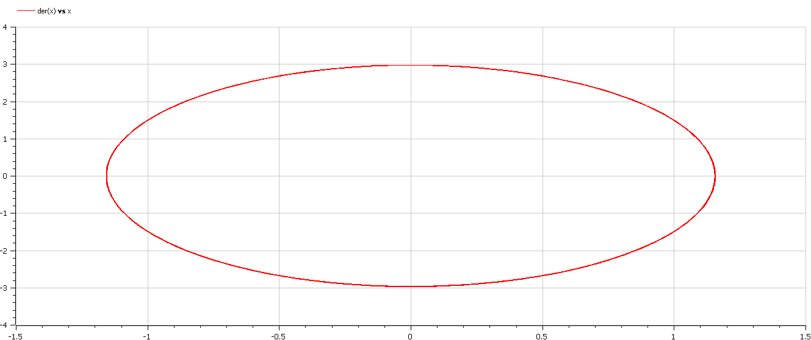
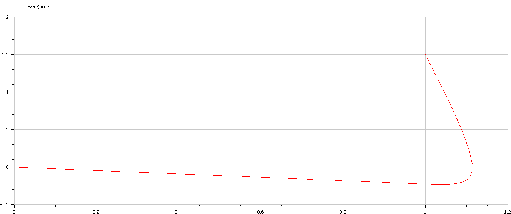
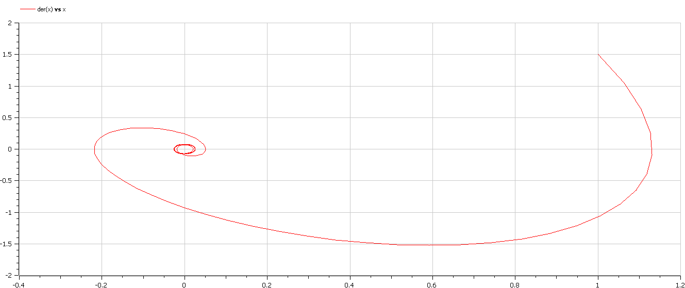

---
# Front matter
title: "Отчёт по лабораторной работе №4"
subtitle: "Вариант 44"
author: "Василий Олегович Худицкий"

# Generic otions
lang: ru-RU
toc-title: "Содержание"

# Pdf output format
toc: true # Table of contents
toc_depth: 2
lof: true # List of figures
lot: true # List of tables
fontsize: 12pt
linestretch: 1.5
papersize: a4
documentclass: scrreprt
## I18n
polyglossia-lang:
  name: russian
  options:
	- spelling=modern
	- babelshorthands=true
polyglossia-otherlangs:
  name: english
### Fonts
mainfont: PT Serif
romanfont: PT Serif
sansfont: PT Sans
monofont: PT Mono
mainfontoptions: Ligatures=TeX
romanfontoptions: Ligatures=TeX
sansfontoptions: Ligatures=TeX,Scale=MatchLowercase
monofontoptions: Scale=MatchLowercase,Scale=0.9
## Biblatex
biblatex: true
biblio-style: "gost-numeric"
biblatexoptions:
  - parentracker=true
  - backend=biber
  - hyperref=auto
  - language=auto
  - autolang=other*
  - citestyle=gost-numeric
## Misc options
indent: true
header-includes:
  - \linepenalty=10 # the penalty added to the badness of each line within a paragraph (no associated penalty node) Increasing the value makes tex try to have fewer lines in the paragraph.
  - \interlinepenalty=0 # value of the penalty (node) added after each line of a paragraph.
  - \hyphenpenalty=50 # the penalty for line breaking at an automatically inserted hyphen
  - \exhyphenpenalty=50 # the penalty for line breaking at an explicit hyphen
  - \binoppenalty=700 # the penalty for breaking a line at a binary operator
  - \relpenalty=500 # the penalty for breaking a line at a relation
  - \clubpenalty=150 # extra penalty for breaking after first line of a paragraph
  - \widowpenalty=150 # extra penalty for breaking before last line of a paragraph
  - \displaywidowpenalty=50 # extra penalty for breaking before last line before a display math
  - \brokenpenalty=100 # extra penalty for page breaking after a hyphenated line
  - \predisplaypenalty=10000 # penalty for breaking before a display
  - \postdisplaypenalty=0 # penalty for breaking after a display
  - \floatingpenalty = 20000 # penalty for splitting an insertion (can only be split footnote in standard LaTeX)
  - \raggedbottom # or \flushbottom
  - \usepackage{float} # keep figures where there are in the text
  - \floatplacement{figure}{H} # keep figures where there are in the text
---

# Цель работы

- Научиться строить модели гармонических колебаний.
- Научиться решать уравнения гармонического осциллятора.
- Научиться переходить от дифференциального уравнения второго порядка к системе из двух дифференциальных уравнений первого порядка.
- Научиться строить фазовый портрет гармонических колебаний.


# Задание

Построить фазовый портрет гармонического осциллятора и решение уравнения гармонического осциллятора для следующих случаев:
1. Колебания гармонического осциллятора без затуханий и без действий внешней силы:
$\ddot{x}+6.6x=0$
2. Колебания гармонического осциллятора c затуханием и без действий внешней силы:
$\ddot{x}+9\dot{x}+2x=0$
3. Колебания гармонического осциллятора c затуханием и под действием внешней силы:
$\ddot{x}+2.4\dot{x}+6x=0.2cos(3t)$

На интервале $t\in[0;52]$ (шаг $0.05$) с начальными условиями $x_0=1$, $y_0=-1.5$.

# Теоретическое введение

## Гармонический осциллятор
Гармони́ческий осциллятор — система, которая при выведении её из положения равновесия испытывает действие возвращающей силы $F$, пропорциональной смещению $x$:

$ F=-kx$,

где k — постоянный коэффициент.

Если F — единственная сила, действующая на систему, то систему называют простым или консервативным гармоническим осциллятором. Свободные колебания такой системы представляют собой периодическое движение около положения равновесия (гармонические колебания). Частота и амплитуда при этом постоянны, причём частота не зависит от амплитуды.

Если имеется ещё и сила трения (затухание), пропорциональная скорости движения (вязкое трение), то такую систему называют затухающим или диссипативным осциллятором. Если трение не слишком велико, то система совершает почти периодическое движение — синусоидальные колебания с постоянной частотой и экспоненциально убывающей амплитудой. Частота свободных колебаний затухающего осциллятора оказывается несколько ниже, чем у аналогичного осциллятора без трения.

Если осциллятор предоставлен сам себе, то говорят, что он совершает свободные колебания. Если же присутствует внешняя сила (зависящая от времени), то говорят, что осциллятор испытывает вынужденные колебания.

Механическими примерами гармонического осциллятора являются математический маятник (с малыми углами отклонения), груз на пружине, торсионный маятник и акустические системы. Среди немеханических аналогов гармонического осциллятора можно выделить электрический гармонический осциллятор.
## Модель
Уравнение свободных колебаний гармонического осциллятора имеет следующий вид:

$\ddot {x} +2\gamma\dot{x}+ \omega_0^2x = 0$

где $x$ – переменная, описывающая состояние системы,$\gamma$ – параметр, характеризующий потери энергии (трение в механической системе, сопротивление в контуре),$\omega_0$ – собственная частота колебаний, t – время.
При отсутствии потерь в системе получаем уравнение консервативного осциллятора, энергия колебания которого сохраняется во времени:

​																     $ \ddot {x} + w_0^2x = 0  \   (1) $


   Для однозначной разрешимости уравнения второго порядка необходимо задать два начальных условия вида:

​															  	$ \begin{cases} x(t_0) = x_0 \\ \dot{x}(t_0) = y_0 \end{cases} $

   Уравнение второго порядка $(1)$ можно представить в виде системы двух уравнений первого порядка:

​															  	$ \begin{cases} \dot{x} = y \\ \dot{y} = -w_0^2x \end{cases} $

​	Для уравнения 

$ \ddot {x} + 2 \gamma \dot {x} + w_0^2x = 0 $ 

система примет следующий вид:

​															  	$ \begin{cases} \dot{x} = y \\ \dot{y} = -2 \gamma \dot {x} - w_0^2x \end{cases} $

​	Для уравнения 

$ \ddot {x} + 2 \gamma \dot {x} + w_0^2x = f(t) $ 

система примет следующий вид:

​															  	$ \begin{cases} \dot{x} = y \\ \dot{y} = -2 \gamma \dot {x} - w_0^2x + f(t) \end{cases} $

   Начальные условия для системы примут вид:

​															  	$ \begin{cases} x(t_0) = x_0 \\ y(t_0) = y_0 \end{cases} $

   Независимые переменные x, y определяют пространство, в котором движется решение. Это фазовое пространство системы, поскольку оно двумерно будем называть его фазовой плоскостью.

   Значение фазовых координат x, y в любой момент времени полностью определяет состояние системы. Решению уравнения движения как функции времени отвечает гладкая кривая в фазовой плоскости. Она называется фазовой траекторией. Если множество различных решений (соответствующих различным начальным условиям) изобразить на одной фазовой плоскости, возникает общая картина поведения системы. Такую картину, образованную набором фазовых траекторий, называют фазовым портретом.

## Ответы на вопросы к лабораторной работе
1. Запишите простейшую модель гармонических колебаний

    Уравнение гармонического колебания имеет вид

    $x(t) = Acos(ωt + φ0)$

     или 

    $x(t) = Asin(ωt + φ0)$

    Дифференциальное уравнение, описывающее простейшую модель гармонических колебаний имеет вид

    $\ddot{x}+ω^2x=0$

2. Дайте определение осциллятора

    Осциллятор — система, совершающая колебания, то есть показатели которой периодически повторяются во времени.

3. Запишите модель математического маятника

      $\frac{d^2 \alpha}{d t^2} + \frac{g}{L} \alpha = 0$

   ​	или

      $\frac{d^2 \alpha}{d t^2} + \omega^2 \alpha = 0$

4. Запишите алгоритм перехода от дифференциального уравнения второго порядка к двум дифференциальным уравнениям первого порядка

    Для дифференциального уравнения 2-го порядка

   $\ddot {x} + 2g\dot {x} + w_0^2x = f(t)$

   Необходимо сделать замену: 

   $y = \dot{x}$

   Тогда получим систему уравнений: 

   $\begin{cases} y = \dot{x} \\ \dot{y} = -2gy - w_0^2x + f(t) \end{cases}$

5. Что такое фазовый портрет и фазовая траектория?

    Фазовая траектория — кривая в фазовой плоскости, отвечающая решению уравнения движения как функции времени.
    Фазовый портрет исследуемой системы — это совокупность фазовых траекторий для всевозможных начальных условий.


# Выполнение лабораторной работы

## 1. Колебания гармонического осциллятора без затуханий и без действий внешней силы
1.1. Уравнение $\ddot{x}+6.6x=0$ приводится к системе вида:

$\begin{cases} \dot{x}=y \\ \dot{y} = -6.6x \end{cases}$

1.2. Построение фазового портрета

Код на Modelica:
```Modelica
 model lab4case1
  constant Real w=sqrt(6.6);//параметр омега(частота колебаний)
  Real x;
  Real y;

 initial equation
  x=1;//x(t0)=x0
  y=1.5;//y(t0)=y0
  
 equation
  der(x)=y;//первое уравнение системы
  der(y)=-w*w*x;//второе уравнение системы
 end lab4case1;
 ```
1.3. Фазовый портрет(рис. [-@fig:001])
{#fig:001 width=70%}
## 2. Колебания гармонического осциллятора c затуханием и без действий внешней силы
2.1. Уравнение $\ddot{x}+9\dot{x}+2x=0$ приводится к системе вида:

$\begin{cases} \dot{x}=y \\ \dot{y}=-9y-2x \end{cases}$

2.2. Построение фазового портрета

Код на Modelica:
```Modelica
 model lab4case2
  constant Real w=sqrt(2);
  constant Real g=4.5;
  Real x;
  Real y;

 initial equation
  x=1;
  y=1.5;
  
 equation
  der(x)=y;
  der(y)=-2*g*y-w*w*x;
 end lab4case2;

 ```
2.3. Фазовый портрет(рис. [-@fig:002])
{#fig:002 width=70%}
## 3. Колебания гармонического осциллятора c затуханием и под действием внешней силы
3.1. Уравнение $\ddot{x}+2.4\dot{x}+6x=0.2cos(3t)$ приводится к системе вида:

$\begin{cases} \dot{x}=y \\ \dot{y}=-2.4y-6x+0.2cos(3t)\end{cases}$

3.2. Построение фазового портрета

Код на Modelica:
```Modelica
 model lab4case3
  constant Real w=sqrt(6);
  constant Real g=1.2;
  Real x;
  Real y;
  Real f;

 initial equation
  x=1;
  y=1.5;
  f=0.2;
  
 equation
  f=0.2*cos(3*time);
  der(x)=y;
  der(y)=-2*g*y-w*w*x+f;
 end lab4case3;

 ```
3.3. Фазовый портрет(рис. [-@fig:003])
{#fig:003 width=70%}


# Выводы

Научился строить модели и решать уравнения гармонических осцилляторов, строить фазовый портрет гармонических колебаний
  -  без затуханий и без действий внешней силы
  -  с затуханием и без действий внешней силы
  -  с затуханием и под действием внешней силы


# Список литературы

- <code>[Кулябов Д.С. *Лабораторная работа №4*](https://esystem.rudn.ru/mod/resource/view.php?id=831041)</code>
- <code>[Кулябов Д.С. *Задания к лабораторной работе №4 (по вариантам)*](https://esystem.rudn.ru/mod/resource/view.php?id=831042)</code>